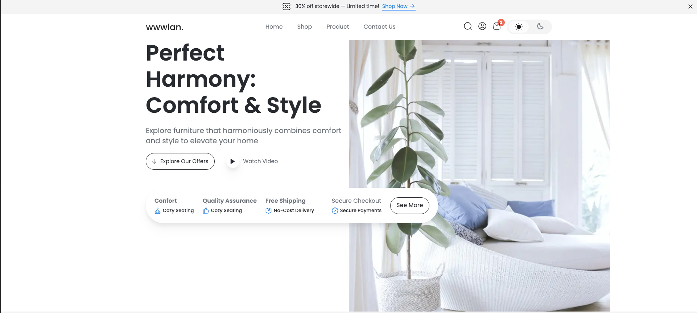

# E-Shoes


## Description

An e-commerce application build with Next.js 14, antd, tailwind with admin section to manage products and checkout section using Stripe

<!-- View the <a href = "https://e-shoes.herokuapp.com/">site</a> -->

## Technologies & Tools

* Next.js

* Node.js

* HTML

* SCSS 

* SQL

* antd, etc...

## Installation and Usage

### Requirements:

* Node.js installed

### Inside the app:

- Landing Page


### Steps:
1. Clone FE's repo on your local machine:
```
$ git clone https://github.com/KhangNg92/ecommerce
```
2. Create .env file with following properties:

```
PORT=5001

NEXTAUTH_SECRET=<YOU CAN NAME WHATEVER SECRET>
NEXTAUTH_URL=http://localhost:5001
```
2. Start client:
```
$ pnpm i
$ pnpm dev
```
6. App now running on localhost:5001